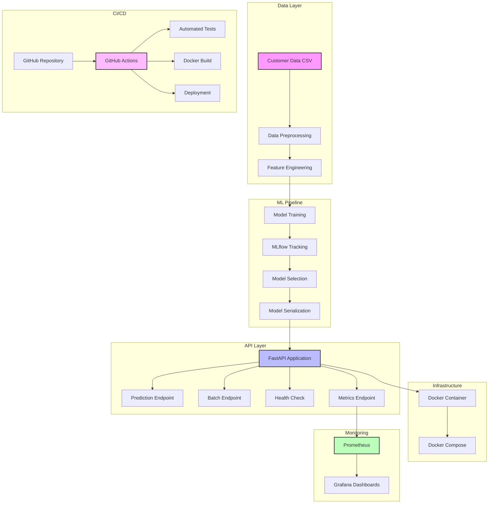
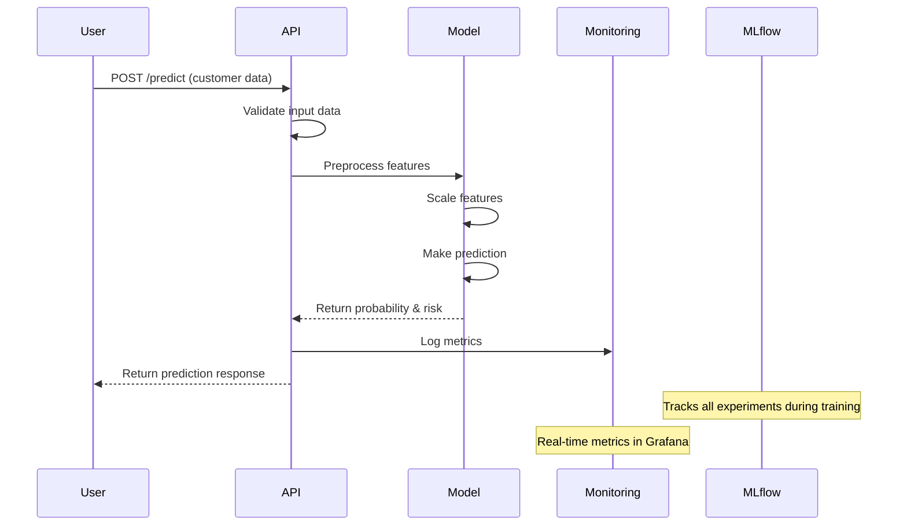
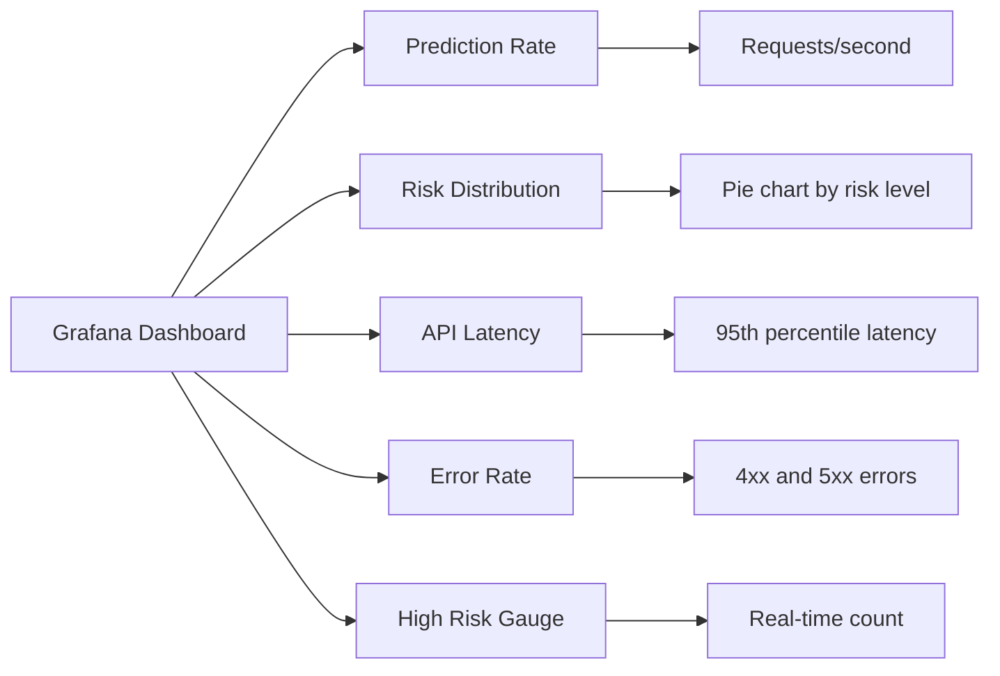
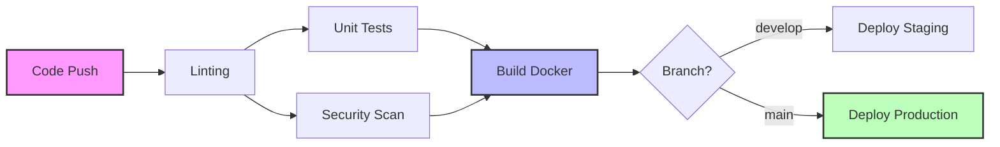

# 🚀 MLOps Customer Churn Prediction System

> A production-ready machine learning system implementing end-to-end MLOps practices for predicting customer churn using modern tools and best practices.

## 📋 Table of Contents

- [Project Overview](#project-overview)
- [Architecture](#architecture)
- [Technology Stack](#technology-stack)
- [Project Structure](#project-structure)
- [Prerequisites](#prerequisites)
- [Installation Guide](#installation-guide)
- [Running the Project](#running-the-project)
- [API Documentation](#api-documentation)
- [Monitoring & Visualization](#monitoring--visualization)
- [Testing](#testing)
- [CI/CD Pipeline](#cicd-pipeline)
- [Troubleshooting](#troubleshooting)
- [Contributing](#contributing)

## 🎯 Project Overview

### What is this project?

This project is a **complete MLOps pipeline** for predicting customer churn in a telecommunications company. It demonstrates how to build, deploy, and monitor a machine learning model in a production environment using industry-standard tools and practices.

### Why Customer Churn Prediction?

Customer churn (when customers stop using a service) is a critical business metric. By predicting which customers are likely to churn, businesses can:
- **Proactively retain customers** through targeted interventions
- **Reduce revenue loss** by preventing customer departures
- **Optimize marketing spend** by focusing on at-risk customers
- **Improve customer satisfaction** through personalized engagement

### What makes this an MLOps project?

This isn't just a machine learning model - it's a complete **production-ready system** that includes:

1. **Version Control**: Git/GitHub for code versioning
2. **Experiment Tracking**: MLflow for tracking model experiments
3. **Model Training**: Automated pipeline with multiple algorithms
4. **API Deployment**: FastAPI for serving predictions
5. **Containerization**: Docker for consistent deployments
6. **CI/CD**: GitHub Actions for automated testing and deployment
7. **Monitoring**: Prometheus + Grafana for real-time metrics
8. **Testing**: Comprehensive unit and integration tests

## 🏗️ Architecture

### System Architecture Diagram



### Data Flow Diagram



## 🛠️ Technology Stack

### Core Technologies

| Component | Technology | Purpose |
|-----------|------------|---------|
| **Language** | Python 3.12 | Primary programming language |
| **ML Framework** | Scikit-learn | Machine learning algorithms |
| **Experiment Tracking** | MLflow | Track experiments, models, metrics |
| **API Framework** | FastAPI | High-performance REST API |
| **Containerization** | Docker | Application packaging |
| **Orchestration** | Docker Compose | Multi-container coordination |
| **Monitoring** | Prometheus | Metrics collection |
| **Visualization** | Grafana | Metrics dashboards |
| **CI/CD** | GitHub Actions | Automated workflows |
| **Testing** | Pytest | Unit and integration tests |

### Python Libraries

- **Data Processing**: pandas, numpy
- **Machine Learning**: scikit-learn, joblib
- **API Development**: fastapi, uvicorn, pydantic
- **Monitoring**: prometheus-fastapi-instrumentator
- **Visualization**: matplotlib, seaborn
- **Development**: jupyter, black, flake8

## 📁 Project Structure

```mermaid
graph TD
    A[mlops-churn-prediction/] --> B[app/]
    A --> C[notebooks/]
    A --> D[tests/]
    A --> E[grafana/]
    A --> F[scripts/]
    A --> G[.github/]
    A --> H[Docker files]
    A --> I[Config files]
    
    B --> B1[main.py<br/>FastAPI application]
    B --> B2[model.py<br/>Model handler]
    B --> B3[schema.py<br/>Data validation]
    B --> B4[*.pkl<br/>Trained models]
    
    C --> C1[train_model.ipynb<br/>Model training]
    
    D --> D1[test_api.py<br/>API tests]
    D --> D2[test_model.py<br/>Model tests]
    
    E --> E1[provisioning/<br/>Dashboards & datasources]
    
    F --> F1[load_test.py<br/>Performance testing]
    
    G --> G1[workflows/<br/>CI/CD pipelines]
    
    H --> H1[Dockerfile]
    H --> H2[docker-compose.yml]
    
    I --> I1[requirements.txt]
    I --> I2[prometheus.yml]
    I --> I3[.gitignore]
    
    style A fill:#f96,stroke:#333,stroke-width:4px
    style B fill:#9cf,stroke:#333,stroke-width:2px
    style C fill:#fc9,stroke:#333,stroke-width:2px
    style D fill:#c9f,stroke:#333,stroke-width:2px
    style E fill:#9fc,stroke:#333,stroke-width:2px
```



### Detailed File Structure

```
mlops-churn-prediction/
├── app/                          # FastAPI application
│   ├── __init__.py              # Package initializer
│   ├── main.py                  # FastAPI app with endpoints
│   ├── model.py                 # ML model handler class
│   ├── schema.py                # Pydantic models for validation
│   ├── churn_model.pkl          # Trained model (generated)
│   ├── scaler.pkl               # Feature scaler (generated)
│   └── feature_names.pkl        # Feature list (generated)
│
├── notebooks/                    # Jupyter notebooks
│   └── train_model.ipynb        # Model training & experimentation
│
├── tests/                       # Test suite
│   ├── __init__.py
│   ├── test_api.py             # API endpoint tests
│   └── test_model.py           # Model handler tests
│
├── grafana/                     # Grafana configuration
│   └── provisioning/
│       ├── dashboards/         # Dashboard configs
│       │   ├── dashboard.yml
│       │   └── churn-prediction-dashboard.json
│       └── datasources/        # Data source configs
│           └── prometheus.yml
│
├── scripts/                     # Utility scripts
│   └── load_test.py            # Load testing script
│
├── .github/                     # GitHub configuration
│   └── workflows/
│       └── ci-cd.yaml          # CI/CD pipeline
│
├── Dockerfile                   # Docker image definition
├── docker-compose.yml          # Multi-container setup
├── prometheus.yml              # Prometheus configuration
├── requirements.txt            # Python dependencies
├── .gitignore                  # Git ignore rules
├── .dockerignore              # Docker ignore rules
└── README.md                   # This file
```

## 📋 Prerequisites

### System Requirements

- **Operating System**: macOS, Linux, or Windows with WSL2
- **Python**: 3.11 or 3.12 (3.13 may have compatibility issues)
- **Memory**: Minimum 8GB RAM
- **Storage**: At least 5GB free space
- **Docker**: Docker Desktop installed and running
- **Git**: Version control system

### Required Software

1. **Python 3.12** (recommended)
   ```bash
   python --version  # Should show 3.12.x
   ```

2. **Docker Desktop**
   ```bash
   docker --version  # Should show Docker version
   docker compose version  # Should show Compose version
   ```

3. **Git**
   ```bash
   git --version  # Should show git version
   ```

## 🔧 Installation Guide

### Step 1: Clone the Repository

```bash
# Clone the repository
git clone https://github.com/YOUR_USERNAME/mlops-churn-prediction.git

# Navigate to project directory
cd mlops-churn-prediction
```

### Step 2: Set Up Python Environment

```bash
# Create virtual environment
python3 -m venv venv

# Activate virtual environment
# On macOS/Linux:
source venv/bin/activate
# On Windows:
venv\Scripts\activate

# Upgrade pip
pip install --upgrade pip

# Install dependencies
pip install -r requirements.txt
```

### Step 3: Train the Model

```bash
# Navigate to notebooks directory
cd notebooks

# Start Jupyter notebook
jupyter notebook

# Open train_model.ipynb and run all cells
# This will create model files in the app/ directory
```

### Step 4: Verify Installation

```bash
# Go back to project root
cd ..

# Check if model files were created
ls -la app/*.pkl

# You should see:
# - app/churn_model.pkl
# - app/scaler.pkl
# - app/feature_names.pkl
```

## 🚀 Running the Project

### Option 1: Run Locally (Development)

#### Start the API Server

```bash
# Make sure you're in the project root with venv activated
python -m uvicorn app.main:app --reload --host 0.0.0.0 --port 8000

# You'll see:
# INFO: Uvicorn running on http://0.0.0.0:8000
# INFO: Application startup complete.
```

#### Access the API

- **API Documentation**: http://localhost:8000/docs
- **Health Check**: http://localhost:8000/health
- **Metrics**: http://localhost:8000/metrics

### Option 2: Run with Docker (Recommended)

#### Build and Start All Services

```bash
# Build and run all containers
docker compose up --build

# Or run in detached mode (background)
docker compose up -d --build
```

This starts:
- **FastAPI**: http://localhost:8000
- **Prometheus**: http://localhost:9090
- **Grafana**: http://localhost:3000 (admin/admin)
- **MLflow**: http://localhost:5000

#### Check Container Status

```bash
# List running containers
docker compose ps

# View logs
docker compose logs -f app

# Stop all services
docker compose down
```

### Option 3: Run Services Individually

#### API Only

```bash
# Build Docker image
docker build -t churn-api .

# Run container
docker run -p 8000:8000 churn-api
```

#### MLflow UI

```bash
# Start MLflow server
mlflow ui --host 0.0.0.0 --port 5000
```

## 📊 API Documentation

### Endpoints Overview

| Endpoint | Method | Description |
|----------|--------|-------------|
| `/` | GET | Root endpoint with API info |
| `/health` | GET | Health check status |
| `/predict` | POST | Single customer prediction |
| `/batch_predict` | POST | Multiple customer predictions |
| `/model/info` | GET | Model information |
| `/metrics` | GET | Prometheus metrics |
| `/docs` | GET | Interactive API documentation |

### Making Predictions

#### Single Prediction

```bash
curl -X POST "http://localhost:8000/predict" \
  -H "Content-Type: application/json" \
  -d '{
    "gender": "Male",
    "SeniorCitizen": 0,
    "Partner": "Yes",
    "Dependents": "No",
    "tenure": 12,
    "PhoneService": "Yes",
    "MultipleLines": "No",
    "InternetService": "Fiber optic",
    "OnlineSecurity": "No",
    "OnlineBackup": "Yes",
    "DeviceProtection": "No",
    "TechSupport": "No",
    "StreamingTV": "No",
    "StreamingMovies": "No",
    "Contract": "Month-to-month",
    "PaperlessBilling": "Yes",
    "PaymentMethod": "Electronic check",
    "MonthlyCharges": 70.35,
    "TotalCharges": 844.20
  }'
```

**Response:**
```json
{
  "customer_id": "CUST_A1B2C3D4",
  "churn_probability": 0.7823,
  "churn_prediction": "Yes",
  "confidence": 0.5646,
  "risk_level": "High"
}
```

#### Batch Prediction

```python
import requests

batch_data = {
    "customers": [
        {
            # Customer 1 data
            "gender": "Female",
            "SeniorCitizen": 1,
            # ... other fields
        },
        {
            # Customer 2 data
            "gender": "Male",
            "SeniorCitizen": 0,
            # ... other fields
        }
    ]
}

response = requests.post("http://localhost:8000/batch_predict", json=batch_data)
print(response.json())
```

### Input Data Schema

All customer features are required:

| Field | Type | Description | Valid Values |
|-------|------|-------------|--------------|
| gender | string | Customer gender | "Male", "Female" |
| SeniorCitizen | integer | Senior citizen flag | 0, 1 |
| Partner | string | Has partner | "Yes", "No" |
| Dependents | string | Has dependents | "Yes", "No" |
| tenure | integer | Months with company | 0-100 |
| PhoneService | string | Has phone service | "Yes", "No" |
| MultipleLines | string | Multiple phone lines | "Yes", "No", "No phone service" |
| InternetService | string | Internet service type | "DSL", "Fiber optic", "No" |
| OnlineSecurity | string | Online security service | "Yes", "No", "No internet service" |
| OnlineBackup | string | Online backup service | "Yes", "No", "No internet service" |
| DeviceProtection | string | Device protection | "Yes", "No", "No internet service" |
| TechSupport | string | Technical support | "Yes", "No", "No internet service" |
| StreamingTV | string | TV streaming service | "Yes", "No", "No internet service" |
| StreamingMovies | string | Movie streaming | "Yes", "No", "No internet service" |
| Contract | string | Contract type | "Month-to-month", "One year", "Two year" |
| PaperlessBilling | string | Paperless billing | "Yes", "No" |
| PaymentMethod | string | Payment method | "Electronic check", "Mailed check", "Bank transfer", "Credit card" |
| MonthlyCharges | float | Monthly charge amount | > 0 |
| TotalCharges | float | Total charges to date | > 0 |

## 📈 Monitoring & Visualization

### Accessing Monitoring Tools

1. **Prometheus** (http://localhost:9090)
   - Query metrics
   - Check targets
   - View alerts

2. **Grafana** (http://localhost:3000)
   - Login: admin/admin
   - Pre-configured dashboard
   - Real-time metrics

### Available Metrics

| Metric | Description |
|--------|-------------|
| `churn_predictions_total` | Total predictions by type and risk level |
| `churn_prediction_latency_seconds` | Prediction response time |
| `churn_high_risk_customers` | Current high-risk customer count |
| `http_requests_total` | Total HTTP requests |
| `http_request_duration_seconds` | HTTP request duration |

### Grafana Dashboard Features



## 🧪 Testing

### Running Unit Tests

```bash
# Run all tests
pytest tests/ -v

# Run with coverage report
pytest tests/ -v --cov=app --cov-report=html

# Run specific test file
pytest tests/test_api.py -v

# Run specific test
pytest tests/test_api.py::test_predict_valid -v
```

### Running Load Tests

```bash
# Make sure API is running first
python scripts/load_test.py

# Output shows:
# - Total requests
# - Success rate
# - Average response time
# - 95th percentile latency
```

### Test Coverage Areas

1. **API Tests** (`test_api.py`)
   - Health endpoint
   - Prediction endpoint validation
   - Batch prediction
   - Error handling

2. **Model Tests** (`test_model.py`)
   - Model loading
   - Feature preprocessing
   - Prediction logic

## 🔄 CI/CD Pipeline

### GitHub Actions Workflow

The CI/CD pipeline automatically runs on:
- Push to `main` or `develop` branches
- Pull requests to `main`

### Pipeline Stages



### Pipeline Jobs

1. **Lint**
   - Black formatting
   - isort import sorting
   - Flake8 style check

2. **Test**
   - Unit tests with pytest
   - Coverage report
   - Upload to Codecov

3. **Security**
   - Trivy vulnerability scan
   - SARIF report upload

4. **Build**
   - Docker image build
   - Push to registry
   - Tag management

5. **Deploy**
   - Staging (develop branch)
   - Production (main branch)

## 🐛 Troubleshooting

### Common Issues and Solutions

#### Issue: Model files not found

```bash
# Error: Model file not found: app/churn_model.pkl

# Solution:
cd notebooks
jupyter notebook
# Run train_model.ipynb completely
```

#### Issue: Port already in use

```bash
# Error: bind: address already in use

# Solution:
# Find process using port
lsof -i :8000
# Kill the process
kill -9 <PID>
```

#### Issue: Docker not running

```bash
# Error: Cannot connect to Docker daemon

# Solution:
# Start Docker Desktop
open -a Docker
# Wait for it to start, then retry
```

#### Issue: Import errors

```bash
# Error: ModuleNotFoundError

# Solution:
# Make sure venv is activated
source venv/bin/activate
# Reinstall requirements
pip install -r requirements.txt
```

### Debug Commands

```bash
# Check API logs
docker compose logs -f app

# Check container status
docker compose ps

# Access container shell
docker compose exec app bash

# Check Python environment
which python
pip list

# Test imports manually
python -c "import pandas; print(pandas.__version__)"
```

## 🤝 Contributing

### Development Workflow

1. **Fork the repository**
2. **Create feature branch**
   ```bash
   git checkout -b feature/amazing-feature
   ```
3. **Make changes**
4. **Run tests**
   ```bash
   pytest tests/ -v
   ```
5. **Commit changes**
   ```bash
   git commit -m "feat: add amazing feature"
   ```
6. **Push branch**
   ```bash
   git push origin feature/amazing-feature
   ```
7. **Open Pull Request**

### Commit Message Convention

- `feat:` New feature
- `fix:` Bug fix
- `docs:` Documentation
- `style:` Formatting
- `refactor:` Code restructuring
- `test:` Testing
- `chore:` Maintenance

### Code Style

- Use Black for formatting
- Use isort for imports
- Follow PEP 8
- Add type hints
- Write docstrings
